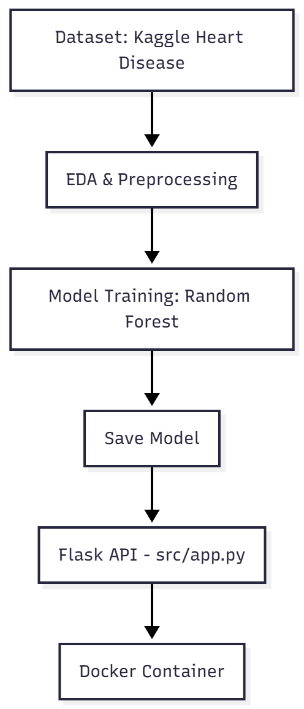

# 🫀 Heart Disease Prediction API

##  Project Overview

This project builds an end-to-end **Heart Disease Risk Prediction System** using machine learning.  
Given a patient’s clinical attributes (age, cholesterol, chest pain type, blood pressure, etc.), the model predicts:

- **0 -> Low risk (no heart disease)**
- **1 -> High risk (heart disease present)**

The final model is deployed as a **Flask-based REST API**, containerized with **Docker**, and trained using the **Kaggle Heart Disease Dataset**.


## Problem Statement

Heart disease remains one of the leading causes of mortality worldwide. Early detection helps prevent severe outcomes and reduces healthcare burdens.

**Goal**: Build a model that predicts whether a patient is likely to have heart disease based on basic health measurements.

Who benefits?
- Clinicians & screening programs
- Health-tech startups
- Preventive-care systems
- Patients looking for early risk assessment


## Dataset

Dataset:  https://kaggle.com/datasets/johnsmith88/heart-disease-dataset

Size:
1. 918 rows
2. 12 clinical features
3. 1 binary target - `target`

Features include:
1. `age` 
2. `sex`
3. `cp` - chest pain type (4 values)
4. `trestbps` - resting blood pressure
5. `chol` - serum cholesterol in mg/dl
6. `fbs` - fasting blood sugar > 120 mg/dl
7. `restecg` - resting electrocardiographic results (values 0,1,2)
8. `thalach` - maximum heart rate achieved
9. `exang` - exercise-induced angina
10. `oldpeak` - ST depression induced by exercise relative to rest
11. `slope` - the slope of the peak exercise ST segment
12. `ca`- number of major vessels (0-3) colored by flourosopy
13. `thal` -  0 = normal; 1 = fixed defect; 2 = reversable defect

The dataset is balanced enough for standard classification metrics.


## EDA Summary

Key observations from exploratory data analysis:
1. `cp` (Chest pain type) showed strong class separation and is one of the most informative categorical features. 
2. `thalach` (max heart rate) had the strongest positive correlation with heart disease. 
3. `oldpeak` shows strong separation; `exang` shows moderate separation between classes.
4. No severe missing values; minor preprocessing required.
5. Standardization improved the performance of linear models; the final model (Random Forest) is scale-invariant but still benefited from consistent preprocessing.

EDA was performed in jupyter notebook and later exported to `heart-disease.py` which is added to this repo.


## Modeling Approach

Models evaluated
1. Logistic Regression
2. Random Forest (best model)
3. XGBoost (overfitted -> rejected)

### Best Model Performance

The final model selected for this project is a **Random Forest Classifier**, chosen for its strong predictive performance and stability.

Using 5-fold cross-validation, the Random Forest achieved:
- **ROC-AUC Mean :** 0.9540  
- **ROC-AUC Std:** 0.0050  

This indicates both **high discriminative ability** and **consistent performance** across folds.

On Test, the Random Forest achieved:
- **Test ROC-AUC:** 0.9542 
- **Test PR-AUC:** 0.9479

## Threshold Selection & Test Evaluation

Instead of using the default probability threshold of **0.50**, a custom threshold was chosen to maximize the **F1-score** on a validation split of the training data.

### Threshold Selection
To find the optimal balance between **precision** and **recall**, the threshold was tuned on the validation portion of the training data.  

The threshold that maximized F1 was: **`0.3871719298250712`**

This lower threshold increases sensitivity to high-risk patients, which is desirable in medical screening tasks.


##  Final Model Evaluation on Test Set

After selecting the threshold, the model was **refit on the full training split** and evaluated on the held-out test set.

### Test Metrics (using threshold = 0.387)


| **Metric**         | **Score**                                   |
|--------------------|---------------------------------------------|
| **Threshold**      | 0.387                                       |
| **Accuracy**       | 0.863                                       |
| **Precision**      | 0.808                                       |
| **Recall**         | 0.962                                       |
| **F1**             | 0.878                                       |
| **ROC-AUC**        | 0.954                                       |


**Primary Metric: ROC-AUC**  
Chosen because the dataset is relatively balanced and ROC-AUC provides a robust measure of ranking performance.

The model demonstrates a **high recall**, which is important in medical risk prediction—fewer high-risk patients are missed.  
Precision remains solid, reflecting a balanced trade-off between false positives and false negatives.


## Project Architecture




## How to Run Locally

1) Create a virtual environment
```bash
python -m venv heart-env
heart-env\Scripts\activate      
```

2) Install dependencies
```bash 
pip install -r requirements.txt
```

3) Run the API locally
```bash 
python src/app.py
```

API runs at: http://127.0.0.1:8000


Test health: http://127.0.0.1:8000/health


## Run with Docker

Use powershell, not cmd

Build image 
```bash 
docker build -t heart-api .
```

Run container
```bash 
docker run -p 8000:8000 heart-api
```

## API Usage Example

POST /predict

Request JSON:
```json
{
  "payload": {
    "age": 63,
    "sex": 1,
    "cp": 3,
    "trestbps": 145,
    "chol": 233,
    "fbs": 1,
    "restecg": 0,
    "thalach": 150,
    "exang": 0,
    "oldpeak": 2.3,
    "slope": 0,
    "ca": 0,
    "thal": 1
  }
}
```


Response:
```json
{
  "prediction": 1,
  "probability": 0.64,
  "threshold": 0.387,
  "risk": "High Risk"
}
```

### Testing the API with `Predict.py`

You can test the deployed API easily by running the provided `Predict.py` script.

Open a **new terminal** (while the API is running in another terminal or Docker container), then run:

```bash
python Predict.py
```
This script sends a sample patient record to the /predict endpoint and prints the model’s response.

If everything is working correctly, you should see an output similar to:

`risk: "High Risk"`